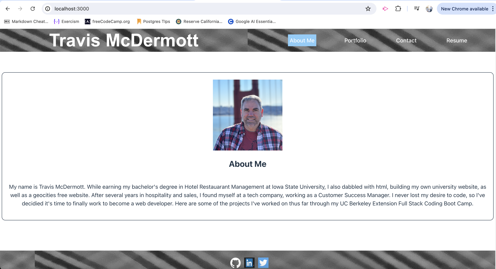
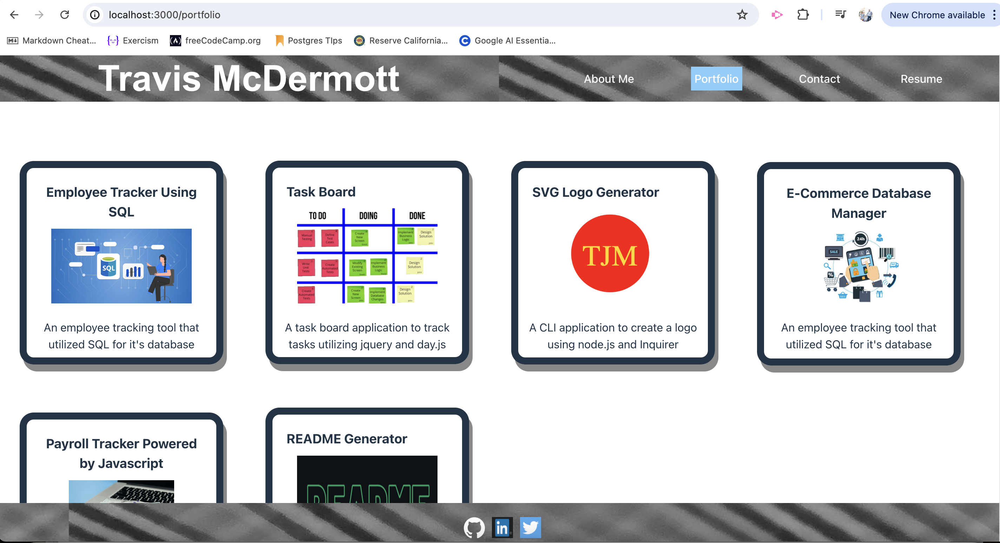
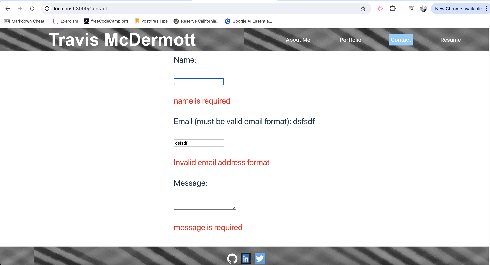
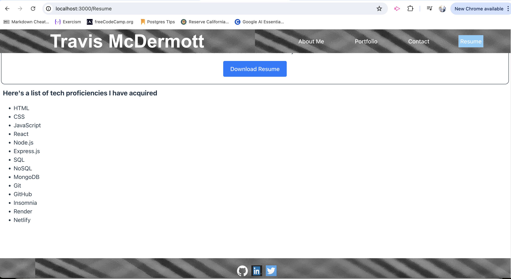

# McDermott Porfolio Built with React

  

  ## Description
  This is my portfolio that I built using React. It contains a header and footer that is always displayed and a middle section that changes based on the Navigation bar selection that is highlighted.

  ## URL of Deployed Application

  [Deployed App on Netlify](https://frolicking-youtiao-0ff742.netlify.app/)

  ## Screenshot of Deployed Application

  

  

  

  

  ## Table of Contents
  - [Installation](#installation)
  - [Usage](#usage)
  - [Contributing](#contributing)
  - [Tests](#tests)
  - [Technologies](#technologies)
  - [License](#license)
  - [Questions](#questions)

  ## Installation
  Enter instructions here

  ## Usage
  This portfolio demonstrates all of the projects that I've completed, including this portfolio, which was created with skills I've gained learning React

  ## Contributing
  N/A

  ## Tests
  N/A

  ## Technologies
  

   ## License
  MIT

  ## Questions

  For any additional questions or feedback, please contact me with the following information:
  Github: (https://github.com/tjmcd2010)
  Email: (mailto:tjmcd2010@gmail.com)  

